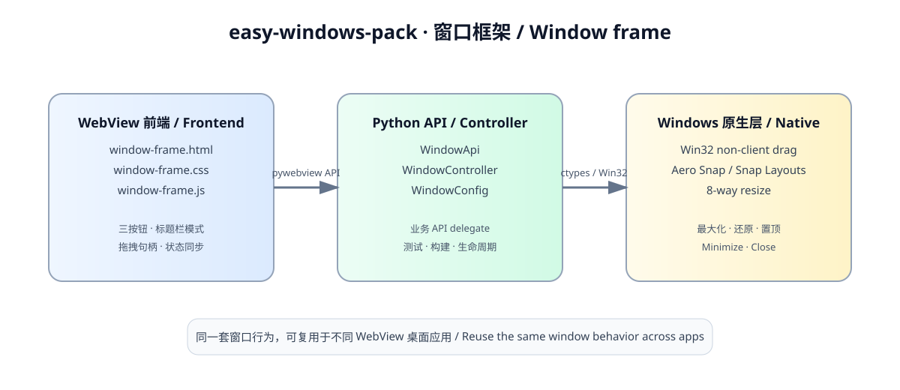
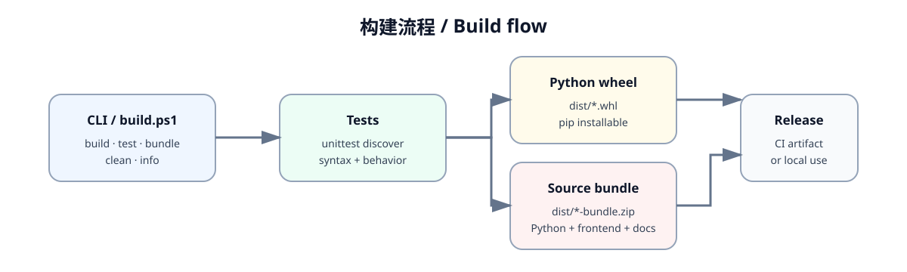

<div align="center">

# easy-windows-pack

### Reusable Windows WebView desktop window framework

[](https://github.com/Binceenigne/easy-windows-pack/actions/workflows/ci.yml)
[](https://www.python.org/)
[](https://pywebview.flowrl.com/)
[](https://github.com/Binceenigne/easy-windows-pack/releases)
[](https://www.microsoft.com/windows)

[中文](README.md) · [English](README.en.md) · [Build tool](#build-tool) · [Architecture](#architecture)

</div>

`easy-windows-pack` is a reusable Windows + pywebview window frame. It extracts title bars, window buttons, native dragging, Aero Snap, Snap Layouts, and eight-way resizing from the business application.

## Architecture



The browser frame sends commands through the pywebview API. `WindowController` owns lifecycle and state, while `win32.py` delegates non-client dragging, resizing, Snap behavior, and topmost state to Windows.

## Features

- Native, default custom, and minimal custom title bars
- Minimize, maximize/restore, and close controls
- Native Windows dragging through `HTCAPTION`
- Restore-while-dragging behavior for maximized windows
- Aero Snap and Windows 11 Snap Layouts
- Eight-way native edge and corner resizing
- Always-on-top, hide/show, and window-size helpers
- Optional close-to-hide lifecycle
- Business API delegation through one pywebview `js_api`
- Framework-free HTML/CSS/JavaScript frontend assets
- CLI, PowerShell build script, wheel, source bundle, and GitHub Actions CI

## Install

From PyPI:

```powershell
pip install easy-windows-pack
```

From a local checkout:

```powershell
pip install -e .
```

## Quick start

```python
from pathlib import Path

import webview

from easy_windows_pack import WindowConfig, create_window

instance = create_window(
    WindowConfig(
        title="My WebView App",
        titlebar_mode="default",
        width=1200,
        height=800,
        min_width=720,
        min_height=480,
        close_action="exit",
    ),
    url=(Path("frontend") / "index.html").resolve().as_uri(),
)

webview.start(gui="edgechromium")
```

Copy `frontend/window-frame.html`, `frontend/window-frame.css`, and `frontend/window-frame.js` into the application frontend. Put the application content inside `[data-ewp-content]`.

## Build tool

Version `0.2.0` includes an installable CLI and a PowerShell wrapper. Version `0.2.1` also serializes WebView2 state updates and suppresses JavaScript evaluation during native minimize transitions. No Node.js build chain is required.

```powershell
# Tests + wheel + source bundle
python -m easy_windows_pack.cli build

# Available after installing the project
easy-windows-pack build

# Windows wrapper
.\build.ps1
```



Artifacts are written to `dist/` by default:

```text
dist/
├── easy_windows_pack-0.2.1-py3-none-any.whl
├── easy-windows-pack-0.2.1-bundle.zip
└── easy-windows-pack-0.2.1-bundle/
    ├── easy_windows_pack/
    ├── frontend/
    ├── examples/
    ├── docs/
    └── easy-windows-pack.manifest.json
```

| Command | Purpose |
| --- | --- |
| `build` | Run tests and build the wheel plus source bundle |
| `test` | Run the unittest suite |
| `bundle` | Build only the source bundle zip |
| `clean` | Remove `build/`, `dist/`, `*.egg-info/`, and `__pycache__/` |
| `info` | Print version, Python executable, and artifact metadata |

Common options:

```powershell
python -m easy_windows_pack.cli build --output-dir .\artifacts
python -m easy_windows_pack.cli build --skip-tests
python -m easy_windows_pack.cli build --skip-tests --skip-bundle
python -m easy_windows_pack.cli bundle --output-dir .\artifacts
.\build.ps1 -Python .\.venv\Scripts\python.exe
```

`build.ps1` resolves Python in this order: the `-Python` argument, project-local `.venv`, `python.exe` on PATH, then `py.exe` on PATH.

### WebView2 synchronization

`WindowController` sends JavaScript through one background dispatcher. State updates are coalesced, so repeated native window events do not start concurrent `evaluate_js` calls. During a minimize or hide transition, queued JavaScript is discarded and the native message is sent immediately. This avoids blocking the WinForms/WebView2 dispatch thread while the window is changing state.

## Title bar modes

### `native`

```python
WindowConfig(titlebar_mode="native")
```

Windows and pywebview own the system title bar, controls, resizing, and Snap Layouts.

### `default`

```python
WindowConfig(titlebar_mode="default")
```

Uses the standard custom HTML title bar. Buttons call `window_action`; dragging uses Win32 `HTCAPTION`.

### `minimal`

```python
WindowConfig(titlebar_mode="minimal")
```

Uses the same behavior as `default` with a compact 24px title bar.

`original` and `system` are compatibility aliases for `native`. Custom modes can switch at runtime. Switching between `native` and a custom mode requires recreating the pywebview window because `frameless` and `easy_drag` are creation-time settings.

## Configuration

| Parameter | Default | Description |
| --- | --- | --- |
| `title` | `WebView Application` | Windows window title |
| `titlebar_mode` | `default` | `native`, `default`, or `minimal` |
| `width` / `height` | `920` / `680` | Initial client size |
| `min_width` / `min_height` | Mode-specific | Minimum dimensions |
| `max_width` / `max_height` | `8192` / `8192` | Maximum dimensions |
| `resizable` | `True` | Enable resizing |
| `shadow` | `True` | Enable the pywebview shadow |
| `always_on_top` | `False` | Create a topmost window |
| `background_color` | `#ffffff` | WebView/native form background |
| `close_action` | `exit` | `exit` or `hide` |
| `maximize_on_start` | `False` | Maximize after creation |

## API delegation

```python
class AppApi:
    def get_profile(self):
        return {"name": "demo"}

create_window(
    WindowConfig(title="My App"),
    url=page_url,
    app_api=AppApi(),
)
```

Both `window_action` and `get_profile` are available through `window.pywebview.api`.

## Development

```powershell
python -m unittest discover -s tests -p "test_*.py" -v
python -m easy_windows_pack.cli info
python -m easy_windows_pack.cli build
```

GitHub Actions tests Python 3.10 and 3.12 on Ubuntu and Windows. A Windows runner builds and uploads the wheel and source bundle.

## Limitations

- Native dragging, resizing, Snap, and topmost behavior target Windows. Imports and unit tests can still run on other platforms.
- The recommended pywebview GUI is `edgechromium`.
- Switching between native and custom title bars requires recreating the pywebview window.
- Tray icons, single-instance enforcement, window-position persistence, and application updates remain host application responsibilities.

<div align="center">

[中文](README.md) · [English](README.en.md) · [Build tool](#build-tool) · [Architecture](#architecture)

</div>
