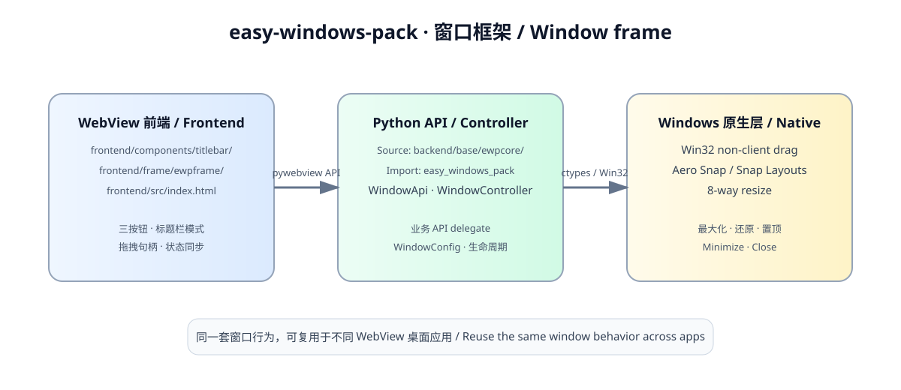
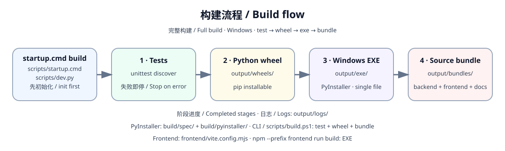

<div align="center">

# easy-windows-pack

### Reusable Windows WebView desktop window framework

[](https://github.com/Binceenigne/easy-windows-pack/actions/workflows/ci.yml)
[](https://www.python.org/)
[](https://pywebview.flowrl.com/)
[](https://github.com/Binceenigne/easy-windows-pack/releases)
[](https://www.microsoft.com/windows)

[中文](README.md) · [English](README.en.md) · [npm / Vite guide](docs/npm-vite.md) · [Developer docs](docs/README.md) · [Build tool](#build-tool) · [Architecture](#architecture)

</div>

`easy-windows-pack` is a reusable Windows + pywebview window frame. It extracts title bars, window buttons, native dragging, Aero Snap, Snap Layouts, and eight-way resizing from the business application.

## Architecture



The browser frame sends commands through the pywebview API. `WindowController` owns lifecycle and state, while `win32.py` delegates non-client dragging, resizing, Snap behavior, and topmost state to Windows.

Root [docs/](docs/README.md) is the development documentation center. Read the
[development guide](docs/development.md) for setup, preview and builds, and the
[architecture and migration guide](docs/architecture.md) for directory boundaries.
Root [index.md](index.md) and [design.md](design.md) remain concise implementation and design summaries.

## Repository layout

```text
easy-windows-pack/
├── backend/
│   ├── base/ewpcore/     # Framework source; public package: easy_windows_pack
│   └── src/demo.py       # Desktop demo and host wiring
├── frontend/
│   ├── frame/ewpframe/   # window-frame.js and desktop-updates.js bridges
│   ├── components/
│   │   ├── titlebar/     # window-frame.html / .css
│   │   └── desktop/      # desktop-components.js / .css
│   ├── index.html       # Vite primary page
│   ├── src/             # main.js, component demo; deprecated old index.html
│   └── contracts/       # TypeScript contracts and integration notes
├── packages/
│   ├── easywindowspack/  # ESM runtime, CSS, wrappers and ewp CLI
│   └── create-ewp/       # Interactive generator, common and six templates
├── docs/                # Development docs, navigation and diagrams
├── scripts/dev.py       # Standard-library development menu
├── scripts/prepare-npm.mjs # Single-source npm resource generation
├── tests/               # Python and browser tests
├── .github/workflows/   # CI
├── output/              # frontend/, wheels/, exe/, bundles/, npm/, logs/
├── build/               # spec/, pyinstaller/ and other build caches
├── build.cmd            # Windows development entry point
├── build.ps1            # Compatible low-level CLI wrapper
├── build-demo.ps1       # Delegates to the development exe task
├── agent.md             # Development rules entry point
├── index.md             # Implementation summary
├── design.md            # Design summary
├── package.json         # Private workspace; root package is not published
├── vite.config.mjs      # Vite ^7.3.7; relative production URLs
└── pyproject.toml
```

The source directory name `ewpcore` does not change public imports. Continue using
`from easy_windows_pack import ...`; `pyproject.toml` maps that package to
`backend/base/ewpcore` through `package-dir`. Reinstall the editable checkout after
migration; do not switch public imports to `ewpcore`.

## Features

- Native, default custom, and minimal custom title bars
- Minimize, maximize/restore, and close controls
- Native Windows dragging through `HTCAPTION`
- Restore-while-dragging behavior for maximized windows
- Aero Snap and Windows 11 Snap Layouts
- Eight-way native edge and corner resizing
- Always-on-top, hide/show, and window-size helpers
- Optional close-to-hide lifecycle
- Business API delegation through one pywebview `js_api`
- Framework-free HTML/CSS/JavaScript frontend assets
- Private npm workspaces, ESM `easywindowspack@0.1.0` / `ewp` CLI, Vite HMR and six Vanilla / Vue / React templates in JS / TS
- Bilingual development menu, compatible CLI / PowerShell wrappers, wheel, single-file EXE, source bundle, and GitHub Actions CI

## npm quick start

Require Node.js **>=22.12.0**, **Python >=3.10** for desktop initialization and packaging, and **WebView2** for Windows desktop. The root npm workspace is private. Both npm packages are version `0.1.0`, independently of Python `easy-windows-pack@0.2.1`.

**Publication is not verified.** The publisher must confirm availability and ownership of the public names `create-ewp` / `easywindowspack`. These registry commands are for use after both packages are published; global installation is optional:

```powershell
npm create ewp@latest
npm create ewp@latest "My App" -- --template react-ts --no-install --no-start
```

Prompts select project name, Vanilla / Vue / React, JavaScript / TypeScript, installation and startup. Alternatively, after publication run `npm install -g easywindowspack`, then `ewp create`, which delegates to dependency `create-ewp/cli`. See the [bilingual guide](docs/npm-vite.md) for local generation before publication, tarball validation and manual publication order.

In the checkout or a generated project whose dependencies are available:

```powershell
npm install
npm run init
npm run dev
# Browser only, without desktop startup
npm run dev -- --web
npm run frontend:dev
```

`init` creates/reuses Python `.venv` and installs Python development and npm dependencies. `dev` starts Vite/HMR on a dynamic loopback port and passes the actual URL via `EWP_DEV_URL` to pywebview with debug enabled. Browser mode needs no Python and has no real native window bridge. The primary entry is [frontend/index.html](frontend/index.html); [frontend/src/index.html](frontend/src/index.html) is a deprecated compatibility entry.

```powershell
npm run frontend:build
npm run build
npm run build -- -w
npm run build -- --wheel
npm run build -- -e
```

Frontend compilation targets `output/frontend/` with relative production asset URLs. `build` defaults to Windows EXE; `-w` / `--wheel` selects wheel and `-e` explicitly selects EXE. **Put npm script arguments after `--`; bare `-w` is npm workspace selection.** Python/PyInstaller packages the EXE with compiled frontend assets only. Framework wheels retain core and source component/bridge assets; generated application wheels include compiled assets. See [build boundaries](docs/npm-vite.md#前端与-python-构建--frontend-and-python-builds).

Use `mountFrame` / `update` / `dispose` from `easywindowspack` and explicitly import `easywindowspack/frame.css`. Desktop components, updates and optional `./vue` / `./react` exports are described in the [public API guide](docs/npm-vite.md#前端公共-api-与模板组合--frontend-public-api-and-template-composition). Vue >=3.3 and React >=18 are optional peers; Vanilla requires neither. Six templates share the runtime; Vue Teleport / React portals preserve reactive application content and events.

## Python installation and compatible integration

From PyPI:

```powershell
pip install easy-windows-pack
```

From a local checkout:

```powershell
pip install -e .
```

For repository development, initialize the project environment and launch the demo:

```powershell
.\build.cmd init
.\build.cmd demo --debug
```

Initialization creates or reuses `.venv`, runs `pip install -e ".[dev,tray]"`,
and installs npm dependencies when a package manifest is present. Directly running
`backend/src/demo.py` requires compiled frontend assets or a development URL.
`build.cmd browser` now delegates browser development to Vite.

## Python window integration

Compile the Vite frontend with `npm run frontend:build` before this example.
`ewp dev` supplies `EWP_DEV_URL` during development. A host using copied static
components can instead supply its own HTML path.

```python
from pathlib import Path

import webview

from easy_windows_pack import WindowConfig, create_window

instance = create_window(
    WindowConfig(
        title="My WebView App",
        titlebar_mode="default",
        width=1200,
        height=800,
        min_width=720,
        min_height=480,
        close_action="exit",
    ),
    url=(Path("output") / "frontend" / "index.html").resolve().as_uri(),
)

webview.start(gui="edgechromium")
```

Copy [the frame markup](frontend/components/titlebar/window-frame.html),
[frame CSS](frontend/components/titlebar/window-frame.css), and
[frame JavaScript](frontend/frame/ewpframe/window-frame.js) into the application
frontend. Put the application content inside `[data-ewp-content]`.

## Build tool

Root `build.cmd` invokes the standard-library `scripts/dev.py` entry point.
Without arguments it opens a bilingual menu; task names also work directly.
The menu keeps its legacy build semantics; current frontend development and
compilation require Node.js/Vite. `init` installs Python build dependencies into
project `.venv` and npm dependencies. See [development](docs/development.md) and
the [npm / Vite guide](docs/npm-vite.md).

```powershell
.\build.cmd
.\build.cmd init
.\build.cmd browser
.\build.cmd frontend
.\build.cmd demo --debug
# Tests + wheel + single-file EXE + source bundle
.\build.cmd build
```



Artifacts use category directories under `output/`; PyInstaller configuration and
caches stay under `build/`:

```text
output/
├── frontend/            # Compiled Vite pages and assets
├── wheels/              # *.whl
├── exe/                 # easy-windows-pack-demo.exe (single file)
├── bundles/             # *-bundle.zip, staging directory and manifest
├── npm/                 # npm pack tarballs
└── logs/                # Initialization and build logs
build/
├── spec/                # PyInstaller specs
└── pyinstaller/         # PyInstaller work cache
```

| Command | Purpose |
| --- | --- |
| `init` | Create/reuse `.venv` and install `.[dev,tray]` plus npm dependencies |
| `browser` | Vite browser development on a dynamic `127.0.0.1` port |
| `frontend` | Compile into `output/frontend/` |
| `demo --debug` | Build frontend and run desktop with developer tools; use `npm run dev` for HMR |
| `wheel` | Build into `output/wheels/` |
| `exe` | Build a PyInstaller single-file demo into `output/exe/`; Windows only |
| `bundle` | Build the source bundle into `output/bundles/` |
| `build` | Run test → wheel → exe → bundle; Windows only |
| `test` | Run Python unittest; browser and native interaction checks are separate |
| `info` | Show interpreter, project environment and output locations |

Use `build.cmd browser --port 8080 --no-open` to choose a port without opening a
browser automatically. Ctrl+C stops the server. Browser preview has no real native
bridge; use a desktop host to verify window dragging, tray and native updates.
Progress reports completed stages, not an estimated time percentage. Failed or
interrupted stages do not mark subsequent work complete. Initialization and build
logs are retained under `output/logs/`.

`build.cmd build` keeps test → wheel → exe → bundle; `npm run build` selects EXE
by default. The historical SVG shows the legacy build flow; the npm guide defines
the current npm path.

### Compatible entry points

The original CLI and `build.ps1` remain available. Their `build` command still runs
tests + wheel + source bundle, without EXE packaging, and defaults to categorized
`output/` directories. `clean` belongs to the low-level CLI, not the development
menu. An explicit `--output-dir` overrides the default artifact location.

```powershell
python -m easy_windows_pack.cli build
easy-windows-pack build
python -m easy_windows_pack.cli build --output-dir .\artifacts
python -m easy_windows_pack.cli build --skip-tests
python -m easy_windows_pack.cli build --skip-tests --skip-bundle
python -m easy_windows_pack.cli bundle --output-dir .\artifacts
.\build.ps1 -Python .\.venv\Scripts\python.exe
.\build-demo.ps1 -Python .\.venv\Scripts\python.exe
```

`build.ps1` resolves Python in this order: the `-Python` argument, project-local `.venv`, `python.exe` on PATH, then `py.exe` on PATH. `build-demo.ps1` delegates to `scripts/dev.py exe`, sharing the same environment, logs and output directories.

### WebView2 synchronization

`WindowController` sends JavaScript through one background dispatcher. State updates are coalesced, so repeated native window events do not start concurrent `evaluate_js` calls. During a minimize or hide transition, queued JavaScript is discarded and the native message is sent immediately. This avoids blocking the WinForms/WebView2 dispatch thread while the window is changing state.

## Title bar modes

### `native`

```python
WindowConfig(titlebar_mode="native")
```

Windows and pywebview own the system title bar, controls, resizing, and Snap Layouts.

### `default`

```python
WindowConfig(titlebar_mode="default")
```

Uses the standard custom HTML title bar. Buttons call `window_action`; dragging uses Win32 `HTCAPTION`.

### `minimal`

```python
WindowConfig(titlebar_mode="minimal")
```

Uses the same behavior as `default` with a compact 24px title bar.

`original` and `system` are compatibility aliases for `native`. Custom modes can switch at runtime. Switching between `native` and a custom mode requires recreating the pywebview window because `frameless` and `easy_drag` are creation-time settings.

## Configuration

| Parameter | Default | Description |
| --- | --- | --- |
| `title` | `WebView Application` | Windows window title |
| `titlebar_mode` | `default` | `native`, `default`, or `minimal` |
| `width` / `height` | `920` / `680` | Initial client size |
| `min_width` / `min_height` | Mode-specific | Minimum dimensions |
| `max_width` / `max_height` | `8192` / `8192` | Maximum dimensions |
| `resizable` | `True` | Enable resizing |
| `shadow` | `True` | Enable the pywebview shadow |
| `always_on_top` | `False` | Create a topmost window |
| `background_color` | `#ffffff` | WebView/native form background |
| `close_action` | `exit` | `exit` or `hide` |
| `maximize_on_start` | `False` | Maximize after creation |

## API delegation

### Optional desktop integrations

`ApiToolsAdapter` exposes API_TOOLS management/settings/update methods through an
explicit allowlist. `TurtleClawAdapter` preserves the desktop updater's install
token and frontend-ready acknowledgement, with an optional host-owned restart
callback. Neither imports or requires either application.

The frontend library now includes responsive dot-matrix progress, a boot curtain,
staggered entrance animations and an optional update polling client. Existing
window frame assets and the single JavaScript dispatcher remain unchanged.

See [integration contracts and examples](docs/desktop-integrations.md) and open
[the offline component demo](frontend/src/components.html). The source bundle includes
the demo; the wheel also ships frontend assets under `share/easy-windows-pack/frontend`.

```python
class AppApi:
    def get_profile(self):
        return {"name": "demo"}

create_window(
    WindowConfig(title="My App"),
    url=page_url,
    app_api=AppApi(),
)
```

Both `window_action` and `get_profile` are available through `window.pywebview.api`.

## New Desktop Components

The components use plain JavaScript and require no Vue, React or CSS framework.
Load [component CSS](frontend/components/desktop/desktop-components.css) and
[component JavaScript](frontend/components/desktop/desktop-components.js), then initialize after the DOM exists.
Load [the update client](frontend/frame/ewpframe/desktop-updates.js) only when needed.

### Dot-Matrix Progress

```html
<link rel="stylesheet" href="desktop-components.css">
<div id="quotaProgress"></div>
<script src="desktop-components.js"></script>
<script>
const progress = EasyWindowsPackComponents.createMatrixProgress(
    document.getElementById('quotaProgress'),
    { value: 70, remaining: 30, size: 4, label: 'Used quota' }
);
progress.update({ value: 75, remaining: 25 });
// On unmount: progress.dispose();
</script>
```

`value` controls the filled percentage; `remaining` independently controls warning
colors. To display remaining quota, pass the same percentage to both and adjust
`label`. `size` is the number of rows and columns per block: `2`, `3`, or `4`
(default). `unlimited: true` displays full unlimited quota; use `unlimitedLabel`
for its accessible text. Give the container a measurable width. A ResizeObserver
handles resizing, with automatic linear fallback when space is insufficient.
`dispose()` releases the observer and generated DOM.

### Boot Curtain and Staggered Entrance

Initialize the entrance controller before showing the page and mark the items
with `data-ewp-enter`. Reveal them after the curtain finishes:

```html
<div id="boot" hidden>Starting</div>
<main id="workspace">
    <header data-ewp-enter>Workspace</header>
    <section data-ewp-enter>Application content</section>
</main>
<script>
const components = EasyWindowsPackComponents;
const entrance = components.createEntrance(document.getElementById('workspace'));
const curtain = components.createBootCurtain(document.getElementById('boot'), {
    timeout: 12000,
    onComplete: ({ reason }) => {
        entrance.reveal();
        if (reason === 'timeout') console.warn('Boot curtain timed out; check initialization');
    }
});
// After the bridge, initial data and essential rendering are ready:
// curtain.setReady();
// On unmount: curtain.dispose(); entrance.dispose();
</script>
```

`createEntrance()` immediately hides the content and temporarily disables its
interaction. Call `reveal()` to enter, or `prepare()` before playing again.
The curtain has a default 12-second watchdog. A timeout removes the curtain but
does not mean initialization succeeded; present a separate error or retry state.
Components respect `prefers-reduced-motion`. Set
`document.documentElement.dataset.motion = 'off'` to disable motion explicitly.

### Update Client

First expose the matching host APIs through `ApiToolsAdapter` or `TurtleClawAdapter`:

```javascript
const updates = createDesktopUpdateClient({
    host: 'turtleclaw', // Use 'api-tools' for API_TOOLS.
    onState: state => console.log('Update state:', state),
    onError: error => console.error(error)
});
// Acknowledge only when the frontend is usable. Checking does not download/install.
await updates.markFrontendReady({ checkOnStartup: true });
// On explicit user action: await updates.check(); await updates.download();
// TurtleClaw requires a valid host-issued token: await updates.install(token);
// API_TOOLS uses await updates.install() to request restart and apply the update.
// On unmount: updates.dispose();
```

`cancel()` requires host support for `cancel_update_download`; do not assume both
hosts support it. `restart()` requires `restart_app`; ordinary TurtleClaw restart
needs an explicitly injected callback. See [integration contracts](docs/desktop-integrations.md)
for Python wiring, allowlists and response contracts, and the
[component demo](frontend/src/components.html) for a runnable visual example.

### Usage Recommendations

- **Use SCSS; Tailwind CSS is not recommended** as the primary styling approach for projects built on this framework. Window chrome, matrix progress, curtains and entrance animations have related state and animation rules. SCSS modules keep these relationships easier to follow and reduce utility-class and dynamic-class maintenance in HTML. This is a maintainability recommendation, not a compatibility restriction.
- Compile SCSS to CSS during development or builds; WebView loads the generated CSS only. The framework currently ships plain CSS, not SCSS sources or a Sass build pipeline. Using the shipped components does not require Sass.
- Keep application styles in separate SCSS modules and load their compiled CSS after component CSS. Prefer existing component custom properties and scoped selectors; avoid editing vendor components or globally overriding tags such as `span` and `i`.
- Existing Tailwind CSS projects can still integrate these components. Check Preflight effects on defaults such as buttons and borders, and avoid using utility classes to compete with internal animation, sizing or visibility rules.
- Create one instance per container, use `update()` for data changes and `dispose()` on unmount. Reserve the curtain for essential initial loading, not optional network requests; do not replay page-wide entrance animations on frequent refreshes.
- Validate narrow windows, DPI scaling, keyboard access and reduced-motion mode. The host remains responsible for download, installation and restart authorization and confirmation; animation completion is not proof of update success.

## Tray Menu and Always-on-Top

Install the optional Windows tray dependencies (`pystray` and Pillow):

```powershell
pip install "easy-windows-pack[tray]"
# From this checkout:
pip install -e ".[tray]"
```

This example uses the shipped window page. Replace the generated icon with a PNG/ICO
path or a Pillow image in your application:

```python
from pathlib import Path
from threading import Event

import webview
from PIL import Image
from easy_windows_pack import (
    TRAY_SEPARATOR, TrayController, TrayMenuItem, WindowConfig, create_window,
)

exiting = Event()
instance = create_window(
    WindowConfig(title="Tray example"),
    url=Path("frontend/src/index.html").resolve().as_uri(),
    on_close=lambda controller: "hide" if tray.running and not exiting.is_set() else "exit",
)

def exit_app():
    exiting.set()
    instance.controller.window_action("close")

image = Image.new("RGBA", (64, 64), "#0f766e")
tray = TrayController(instance.controller, icon=image, title="Tray example", on_exit=exit_app)
tray.set_menu([
    *tray.window_menu(),
    TRAY_SEPARATOR,
    TrayMenuItem("Print state", lambda: print(instance.controller.get_state()),
                 enabled=lambda: instance.controller.visible),
])

def start_tray():
    try:
        tray.start()
    except Exception as error:
        print(f"Tray unavailable: {error}")

try:
    webview.start(start_tray, gui="edgechromium")
finally:
    tray.stop()
    image.close()
```

The default menu provides Show (also the left-click action), Hide, Always on top,
and Exit when `on_exit` is supplied. `menu=[]` creates an empty menu;
`set_menu(items)` replaces it while running. `TrayMenuItem(text, callback,
enabled=True, checked=None, default=False)` accepts a zero-argument Python
callback. `enabled` and `checked` can be booleans or zero-argument functions;
`checked=None` omits the checkmark. Use `TRAY_SEPARATOR` between groups and at
most one default item. Call `refresh_menu()` after changing custom state outside
a menu callback. Window visibility and topmost changes refresh it automatically.

`start(timeout=5.0)` starts a background tray loop and waits for readiness; it is
idempotent while running and raises on missing dependencies, failure, or timeout.
`stop()` requests removal and detaches state listeners without closing the window
or joining the tray loop; the native loop releases its image on exit. A stopped
tray can restart unless the window is closed. Closing the window stops the tray;
hiding it keeps the tray alive. `request_exit()` stops the tray and invokes the
host's required `on_exit` callback once per start. Callback/state-refresh errors
are logged and available as `last_error`. Keep callbacks and state getters short;
they run on background/native threads and must marshal other GUI work as needed.

The existing `set_always_on_top(enabled)` and the new `toggle_always_on_top()` /
`get_always_on_top()` are available on both `WindowController` and `WindowApi`:

```javascript
// After pywebviewready:
const state = await window.pywebview.api.toggle_always_on_top();
if (state.ok) console.log(state.alwaysOnTop);
await window.pywebview.api.set_always_on_top(false);
const current = await window.pywebview.api.get_always_on_top();
```

They return `{ok, alwaysOnTop}`. A failed native update preserves the previous
state. Updates reuse the Win32 implementation and the serialized JS dispatcher;
hidden/minimized windows do not evaluate JS. State listeners receive `closed`
and `alwaysOnTop` through `get_state()` / notifications. Additional listeners can
be registered/removed with `add_state_listener()` / `remove_state_listener()`;
observer exceptions are logged without interrupting window operations.

Tray configuration is Python-only: do not pass `TrayController` as `app_api`.
No tray command strings, shell execution, or arbitrary Python/JS evaluation API
is exposed to the browser. The host owns shutdown policy and business callbacks.

## Development

Use [docs/README.md](docs/README.md) as the documentation entry point. Detailed
setup and troubleshooting live in [docs/development.md](docs/development.md);
directory ownership and old-to-new paths live in [docs/architecture.md](docs/architecture.md).

```powershell
.\build.cmd test
.\build.cmd info
.\build.cmd build
```

CI configuration is maintained in `.github/workflows/`. Historical local checks in
the integration documentation do not certify the current migration or remote CI;
record each current validation separately.

## Limitations

- Native dragging, resizing, Snap, and topmost behavior target Windows. Imports and unit tests can still run on other platforms.
- The recommended pywebview GUI is `edgechromium`.
- Switching between native and custom title bars requires recreating the pywebview window.
- Tray support is optional and targets Windows; the host supplies the icon, menu callbacks, and shutdown policy. Single-instance enforcement, window-position persistence, and application updates remain host responsibilities.

<div align="center">

[中文](README.md) · [English](README.en.md) · [Build tool](#build-tool) · [Architecture](#architecture)

</div>
